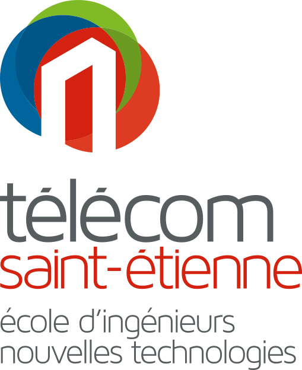

# Astro-Game

#
Conception et développement d’un jeu présentant une scène 3D dans laquelle on se déplace à partir des mouvements des mains capté par la webcam(ou autre caméra externe). 
Développé en utilisant C++, Qt, OpenGL, OpenCV.

# Détail du projet : #

Le but du projet est de développer un jeu présentant une scène 3D dans laquelle on se déplace à partir de mouvements des mains.

Le joueur doit piloter un vaisseau spatial en évitant des astéroïdes et rejoindre une station orbitale estampillée par le logo de TSE. Les déplacements sont en 3D et sont contrôlés par des mouvements des mains captés par la WebCam du PC. Les astéroïdes sont représentés par des sphères texturées fixes dans le repère de la scène. La station orbitale dont la position est fixe, est constituée d’un assemblage de formes géométriques (parallélépipèdes, cylindres et sphères) et comporte le logo de TSE. Le vaisseau spatial, représenté aussi à partir formes géométriques, est vu de l’arrière et peut se déplacer en 3D suivant 3 types de mouvements : rotation dans le plan horizontal, rotation dans le plan vertical et translation suivant la direction du vaisseau. 
Les contraintes du jeu sont :

* La scène devra comporter un nombre fixe d’astéroïdes (typiquement 16) dont la position sera tirée aléatoirement dans le volume occupé par la scène en veillant à ce qu’il n’y ait pas de superposition entre eux. 
* La taille des astéroïdes sera aussi tirée aléatoirement dans une gamme de diamètres fixée. On pourra changer le nombre d’astéroïdes avant le début de la partie dans une option du jeu (pour fixer un niveau de difficulté). 
* Les astéroïdes seront munis d’une texture réaliste.
* Le vaisseau sera constitué de formes géométriques pleines. 
* Sa conception devra être suffisamment esthétique pour ressembler à un vaisseau spatial. 
* La caméra sera attachée à ce vaisseau mais disposée un peu derrière lui pour qu’il soit visible. 
* Un éclairage directionnel sera placé pour donner un rendu réaliste à la scène.
* Une station orbitale sera placée aléatoirement dans la scène. 
* Elle sera constituée de formes géométriques pleines conférant aussi une esthétique adaptée. 
* Elle devra comporter sur l’un de ses éléments, une texture avec le logo de Télécom Saint Etienne.
* Elle sera munie d’une lampe clignotante et tournera lentement sur elle même.
* Le déplacement du joueur sera commandé par des gestes des deux mains grâce à la WebCam.
* Les collisions avec les astéroïdes devront être détectées et devront arrêter la partie (partie perdue).
